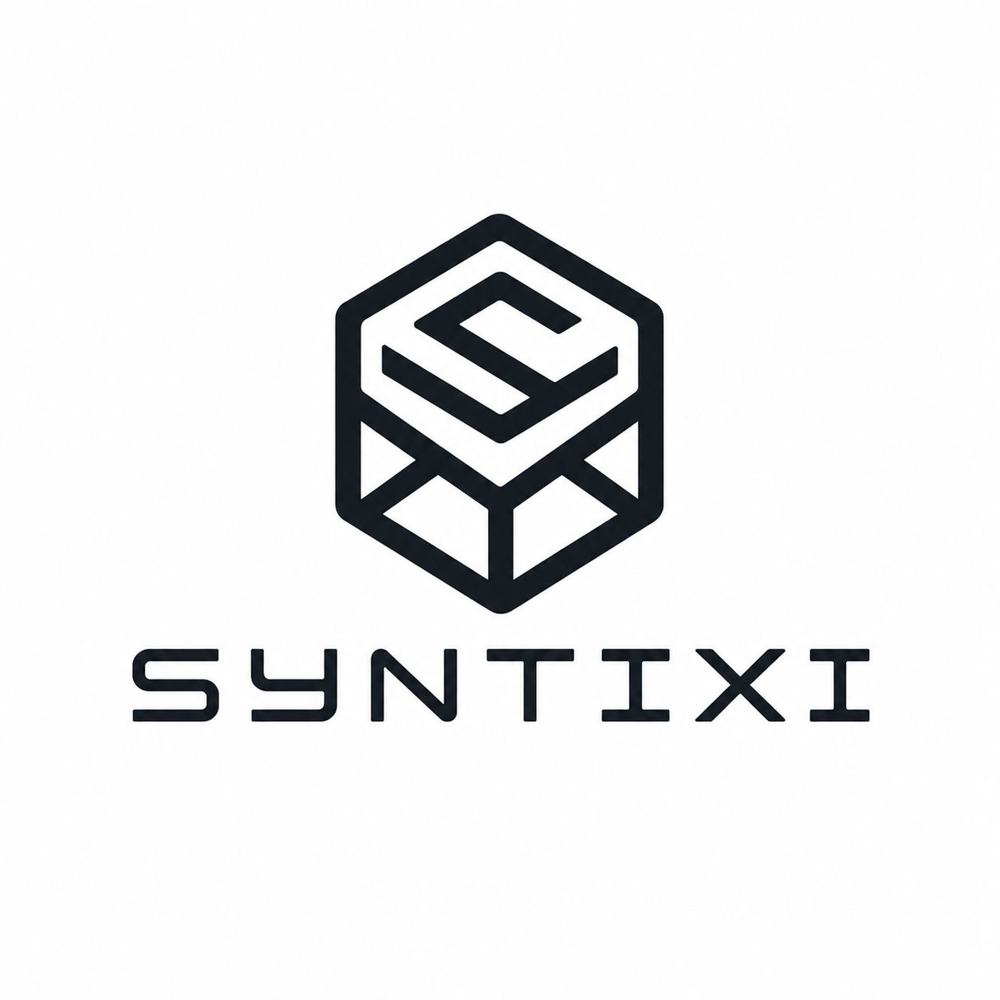
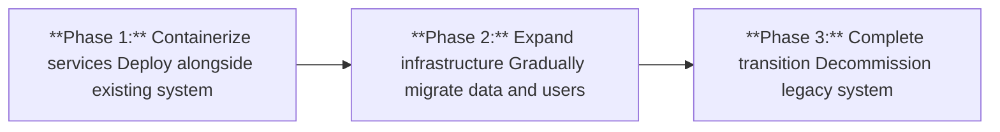
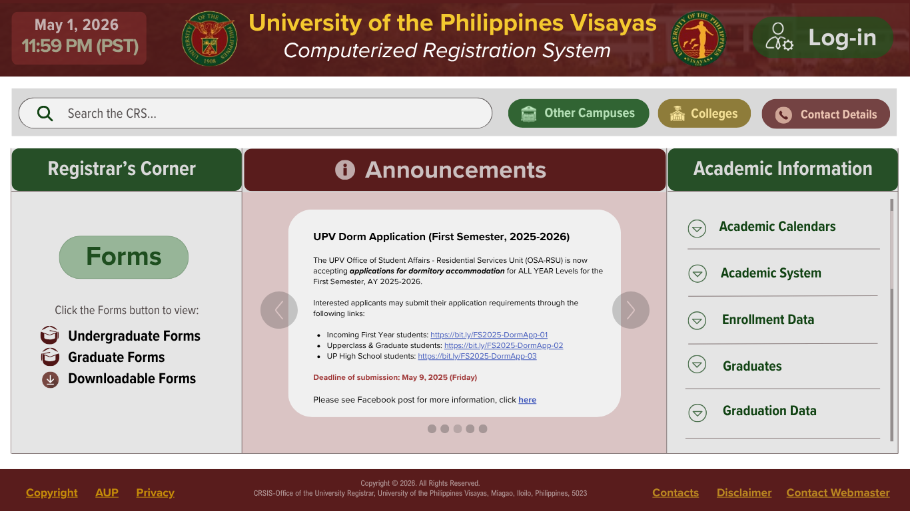
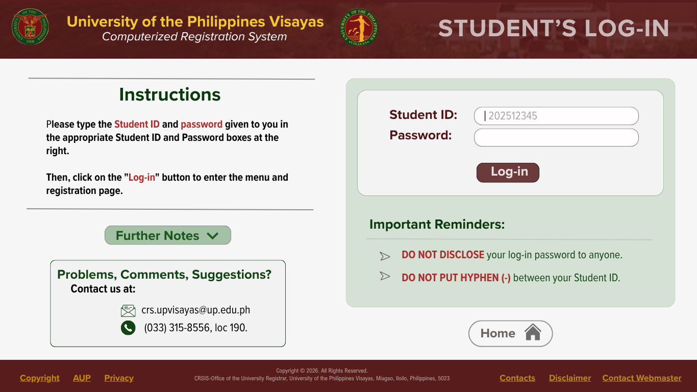
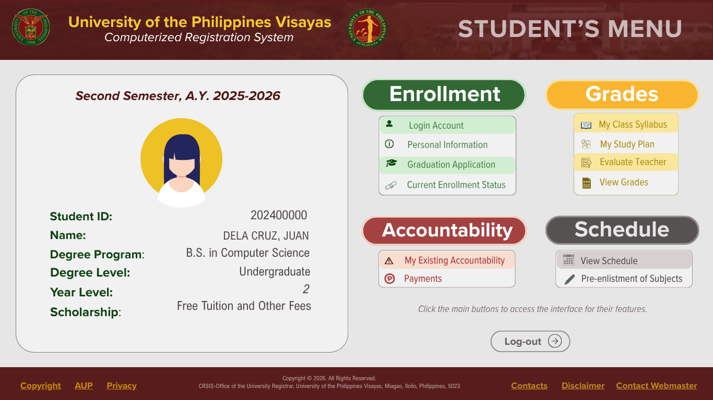
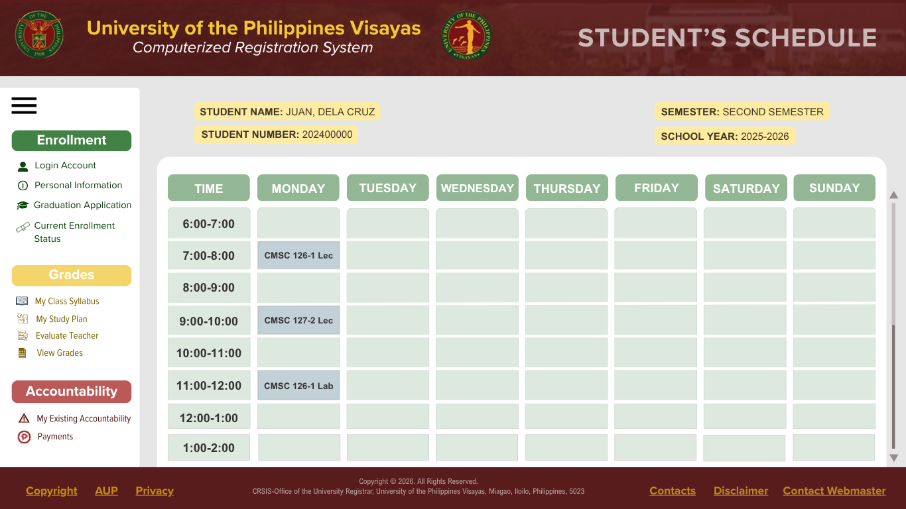
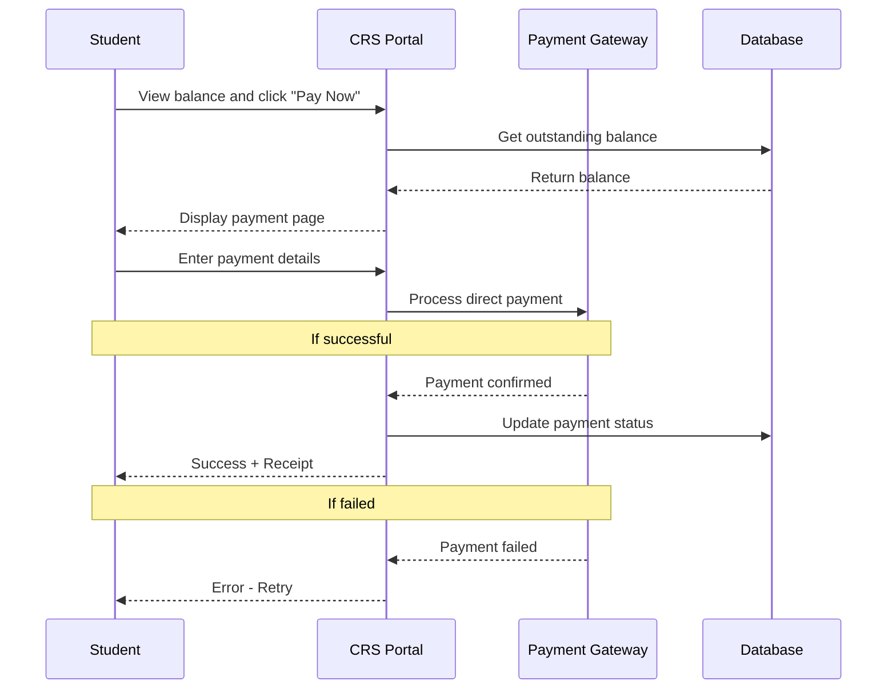
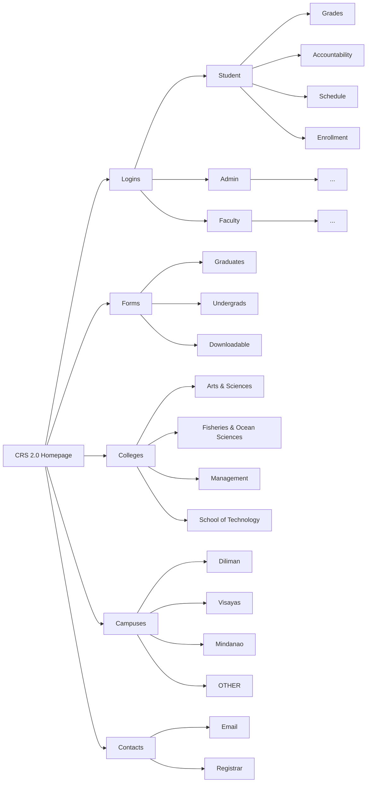
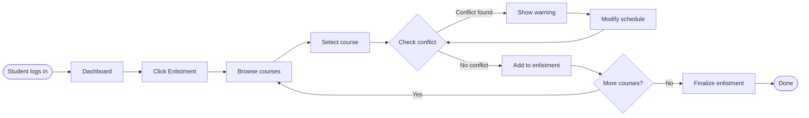

  

  

  # UPV CRS 2.0

  
  
  
  
  
  UPV CRS 2.0 is a redesigned version of the University of the Philippines Visayas Course Registration System (CRS). The update aims to improve usability, performance, and reliability by introducing a more modern web-based platform that supports faster transactions and improved user experience.
  

<table>
<tr>
<td>

### 👥 Team Members
- Justin Lauricio — Product Owner  
- Samantha Mok — Frontend Designer  
- Jhon Chriztopher Nice — Backend Developer  
- Aleighia Keith Reyes — Database Manager  

</td>
<td align="right" style="padding-left: 40px; padding-top: 25px;">
  
</td>
</tr>
</table>

---

## 📖 Table of Contents
 
- [UPV CRS 2.0](#upv-crs-20)
    - [👥 Team Members](#-team-members)
  - [📖 Table of Contents](#-table-of-contents)
  - [⚙️ System Summary](#️-system-summary)
    - [Problem Statement](#problem-statement)
    - [Solution](#solution)
    - [New Features](#new-features)
    - [Fixes](#fixes)
    - [CRS 1.0 Issues vs. CRS 2.0 Solutions](#crs-10-issues-vs-crs-20-solutions)
  - [🛠️ CRS 2.0 — Tech Stack](#️-crs-20--tech-stack)
    - [🎨 Frontend Tools](#-frontend-tools)
    - [⚙️ Backend Tools](#️-backend-tools)
    - [🗄️ Database](#️-database)
    - [⚡ Background Jobs \& Caching](#-background-jobs--caching)
    - [🧪 Testing](#-testing)
    - [📊 Monitoring \& Logging](#-monitoring--logging)
    - [🚀 Deployment \& Infrastructure](#-deployment--infrastructure)
  - [🌐 Hosting](#-hosting)
  - [💻 Mockups](#-mockups)
  - [🏗️ System Architecture](#️-system-architecture)
    - [Direct Payment Process](#direct-payment-process)
    - [CRS 2.0 Simple Sitemap](#crs-20-simple-sitemap)
    - [Course Enlistment Flowchart](#course-enlistment-flowchart)
---
## ⚙️ System Summary

### Problem Statement

The current UPV CRSIS suffers from critical infrastructure issues, poor user experience, and inability to handle peak enrollment traffic, resulting in system crashes during crucial registration periods that affect thousands of students.
 
### Solution 

A modern, scalable, and resilient web application redesign leveraging contemporary cloud-native technologies to ensure reliability, performance, and user satisfaction.
 

### New Features
- Students can now see during course enlistment whether taking a course would cause a conflict with their current schedule
- Direct payment of tuition and other fees through the portal (no more separate Maya QR workaround)

### Fixes
- Improved UI and placements of navigation elements (replaced the outdated newspaper layout)
- Unified portal experience — document requests, schedules, grades, and payments in one place instead of scattered across separate pages
- Bigger text and visual weight to improve visual hierarchy, making key information easier to scan

### CRS 1.0 Issues vs. CRS 2.0 Solutions
**Numerous issues have been identified and reported in CRS 1.0 Here is how CRS 2.0 solves each problem:**

| Issue | CRS 1.0 | CRS 2.0 Solution |
|:--------:|---------|------------------|
| **Schedule conflicts** | No detection (students discover conflicts after enlisting the course) | Real-time conflict checker warns before adding courses |
| **Tuition payment** | Separate Maya QR workaround (leave the portal, use third-party app) | Direct payment integration (pay without leaving CRS) |
| **User interface** | Outdated newspaper layout (poor visual hierarchy) | Modern responsive UI (clear visual weight and navigation) |
| **Portal experience** | Scattered across multiple pages (grades, schedules, documents in different places) | Unified dashboard (everything in one place) |
| **Transaction speed** | Slow processing (long wait times, even crashes during peak enrollment) | Optimized backend through async processing with caching |
| **Text readability** | Small hard-to-read text | Larger text and improved typography |
| **No Real-Time Updates** | Must refresh to see course availability or schedule changes | Live updates on seat counts, schedule changes, and enrollment confirmations |

## 🛠️ CRS 2.0 — Tech Stack

### 🎨 Frontend Tools

The frontend is primary built with **Next.js**, a modern React-based framework that supports Server-Side Rendering (SSR) and Static Site Generation (SSG) — ensuring fast, reliable page loads even during peak enrollment periods. The stack is designed for type safety, consistent UI, and real-time data updates, making it ideal for a high-traffic university system.

| Logo | Technology | Role | Why We Chose It |
|:----:|------------|------|-----------------|
|  | **Next.js** | Core Framework | Provides SSR and SSG for fast page loads during enrollment peaks. File-based routing maps cleanly to pages. |
|  | **TypeScript** | Language | Enforces strict type checking across the codebase — prevents passing wrong data types for student records, course codes, and IDs. |
|  | **Tailwind CSS** | Styling | Utility-first CSS that ensures UI consistency across all pages — components built quickly and uniformly without custom CSS. |
|  | **React Query** | Data Fetching & Caching | Manages server state with intelligent caching and background refetching — students always see up-to-date enrollment data without full page reloads. |
|  | **Zod** | Form Validation | Validates form inputs on the frontend before they reach the backend — ensures malformed enrollment or document data is rejected early. |
|  | **Auth.js** | Authentication | Handles authentication, session management, and OAuth 2.0 integration with UP SSO providers. Supports secure role-aware access flows for students, faculty, and administrators. |

---
 
### ⚙️ Backend Tools
 
The backend is powered by **NestJS** on top of **Node.js**, providing a modular, scalable, and TypeScript-first architecture. It exposes a hybrid API layer — combining **GraphQL** for complex data queries and **REST** for action-based operations — to serve the diverse needs of students, faculty, and administrators efficiently.

| Logo | Technology | Role | Why We Chose It |
|:----:|------------|------|-----------------|
|  | **Node.js** | Runtime Environment | Non-blocking I/O handles hundreds of simultaneous enrollment requests without stalling — critical during peak enrollment windows. |
|  | **NestJS** | Backend Framework | Enforces modular architecture (e.g., `EnrollmentModule`, `GradesModule`, `AuthModule`). More structured and scalable than raw Express.js as the system grows. |
|  | **GraphQL** *(Apollo Server)* | Complex Data Queries | Lets the student dashboard fetch name, GPA, schedule, and units in a single request — reducing unnecessary API calls and over-fetching. |
|  | **REST API** *(OpenAPI/Swagger)* | Action-Based Operations | Used for file uploads, payment webhooks, grade submissions, and admission forms — clear HTTP methods for transactional operations. |
|  | **Passport.js** | API Authentication | Protects backend API endpoints. Handles JWT and session-based auth, integrates with UP SSO on the server side. |
|  | **Zod** | Backend Validation | Validates all incoming API requests and GraphQL inputs on the server side — never trusts data from the client. |

---
 
### 🗄️ Database
 
CRS 2.0 uses **PostgreSQL** as its primary relational database — chosen for its ACID compliance, relational integrity, and powerful features like triggers and full-text search. **Prisma ORM** sits on top to provide type-safe queries and clean schema migrations. **PgBouncer** is added to handle connection pooling under high concurrency.

| Logo | Technology | Role | Why We Chose It |
|:----:|------------|------|-----------------|
|  | **PostgreSQL** | Primary Database | ACID-compliant transactions prevent double enrollments and lost records. Supports complex relationships: students, courses, prerequisites, schedules, and grades. |
|  | **Prisma ORM** | Database Access Layer | Auto-generates TypeScript types from the DB schema for type-safe queries. Handles migrations with rollback support and includes a visual DB explorer (Prisma Studio). |
|  | **PgBouncer** | Connection Pooler | Acts as a proxy between NestJS and PostgreSQL — prevents connection exhaustion when hundreds of students submit requests simultaneously. |

---
 
### ⚡ Background Jobs & Caching

Enrollment requests are processed asynchronously using **Bull** queues backed by **Redis** — so no request is lost even under heavy load. Two separate Redis instances are used: one for volatile caching and one for persistent job queuing.

| Logo | Technology | Role | Why We Chose It |
|:----:|------------|------|-----------------|
|  | **Redis** *(Cache Instance)* | Data Caching | Caches course catalog, schedule data, GPA, and sessions — reduces repetitive DB queries. Short TTLs ensure data freshness. |
|  | **Redis** *(Queue Instance)* | Job Queue Broker | Separate persistent Redis instance for the job queue. Configured with RDB snapshots and AOF so pending jobs survive crashes. |
|  | **BullMQ** | Job Queue Library | Handles asynchronous tasks such as enrollment processing, grade calculations, email notifications, and TOR generation. Provides retry mechanisms, concurrency control, and dead-letter queue support for failed jobs. |

---

### 🧪 Testing

| Logo | Technology | Role | Why We Chose It |
|:----:|------------|------|-----------------|
|  | **Jest** | Unit & Integration Testing | Tests NestJS services, GraphQL resolvers, and validation logic. Targets 70%+ code coverage for critical paths like enrollment and authentication. |

---

### 📊 Monitoring & Logging

| Logo | Technology | Role | Why We Chose It |
|:----:|------------|------|-----------------|
|  | **ELK Stack** *(Elasticsearch, Logstash, Kibana)* | Centralized Logging | Aggregates and indexes logs from NestJS and Next.js. Allows searching logs by student ID, error type, or timestamp. |
|  | **Prometheus** | Metrics Collection | Tracks enrollment queue depth, DB query latency, API response times, and Redis memory usage in real time. |
|  | **Grafana** | Metrics Dashboards & Alerts | Visualizes Prometheus metrics with dashboards. Sends alerts when queue depth spikes or DB queries exceed thresholds. |
|  | **Sentry** | Error Tracking | Automatically captures and groups unhandled exceptions. Alerts the team when error rates spike — e.g., 500 errors in the enrollment endpoint. |

---

### 🚀 Deployment & Infrastructure

| Logo | Technology | Role | Why We Chose It |
|:----:|------------|------|-----------------|
|  | **Docker** | Containerization | Packages the app and all dependencies into containers — ensures consistent environments across development and production. |
|  | **Docker Compose** | Local Dev Orchestration | Spins up PostgreSQL, Redis (cache + queue), NestJS, and Next.js locally with a single command for easy developer setup. |
|  | **Kubernetes / K3s** | Production Orchestration | Manages auto-scaling, load balancing, and container health in production — handles enrollment traffic spikes automatically. K3s may be used as a lightweight alternative on university hardware. |
|  | **Nginx** | Web Server & Reverse Proxy | Serves as the entry point for all HTTP traffic — handles SSL termination, load balancing, and routing to backend services. |
|  | **GitHub Actions** | CI/CD Pipeline | Automates testing and deployment on every push — reduces manual overhead and ensures consistent, reliable releases. |
|  | **CDN (e.g. Cloudflare)** | Static Asset Delivery | Caches and delivers static assets (CSS, JS, images) globally — improves load times and provides DDoS protection. |

---

## 🌐 Hosting
**Overview**

**CRS 2.0** will adopt a hybrid hosting strategy, combining primarily on-premise infrastructure with selective cloud-based services. This approach balances cost efficiency, data security, and modern development practices while leveraging the university’s existing hardware resources.

**Primary Hosting: On-Premise Infrastructure**

The core CRS 2.0 system—including the backend API, application services, and database will be deployed on university-managed servers. To modernize deployment and improve scalability, the system will use:

* **Docker** for containerization
* **Kubernetes (K8s)** or a lightweight distribution such as K3s for orchestration
* **Nginx** as the web server and reverse proxy
* **PostgreSQL** as the primary database

This setup allows the system to run efficiently on existing infrastructure while enabling modular, scalable, and maintainable deployments.

**Key Advantages:**

* **Cost efficiency:** Utilizes existing hardware, minimizing new capital expenditure
* **Data sovereignty:** Sensitive student data remains within university premises
* **Operational continuity:** Aligns with current IT team expertise
* **Scalability:** Additional nodes can be added as needed

**Secondary Hosting: Selective Cloud Services**

Cloud services will be used only where they provide clear operational benefits, without storing sensitive data externally.

**Included Services:**

* **Content Delivery Network (CDN):**
Used for caching and delivering static assets (e.g., CSS, JavaScript, images) to improve load times and provide DDoS protection
* **CI/CD Pipeline:**
Cloud-based tools (e.g., GitHub Actions or GitLab CI) will automate testing and deployment, reducing manual overhead and improving development speed
* **Monitoring and Logging:**
  A self-hosted observability stack (Prometheus, Grafana, ELK Stack, and Sentry) provides 
  full system visibility — covering metrics collection, dashboards, centralized logging, 
  and error tracking — without relying on external cloud services.

**Rationale for Hybrid Approach**

The hybrid model is selected to achieve the following:
* Lower long-term costs compared to full cloud deployment
* Improved security and compliance by keeping critical data on-premise
* Modern development workflow through CI/CD and containerization
* Reduced vendor lock-in, maintaining flexibility for future migration
* Enhanced performance via CDN and optimized infrastructure

**Deployment Strategy**

Implementation will follow a phased rollout:

This phased approach ensures minimal disruption and allows rollback if necessary.

## 💻 Mockups

The following mockups provide a visual overview of the redesigned CRS 2.0 experience, specifically the Home, Student-Log-in, Student Portal, and Schedule pages: 

<b>Home Page</b>

  
  

<b>Student Log-in Page</b>

  
  

<b>Student Portal Page</b>

  
  

<b>Schedule Page</b>

  
  
---

## 🏗️ System Architecture 

The following diagrams illustrates the workflows and structure of CRS 2.0

### Direct Payment Process

---

### CRS 2.0 Simple Sitemap

---

### Course Enlistment Flowchart

