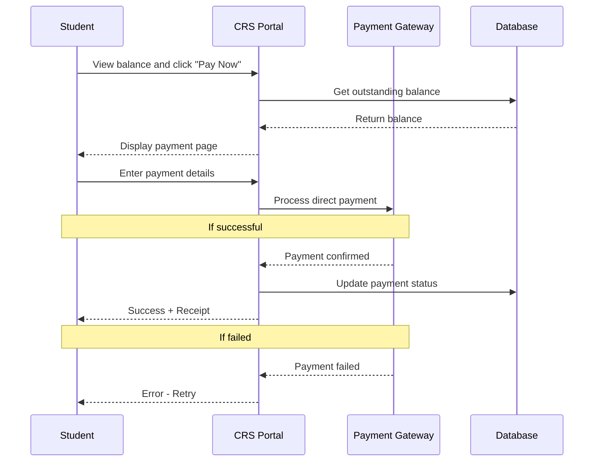
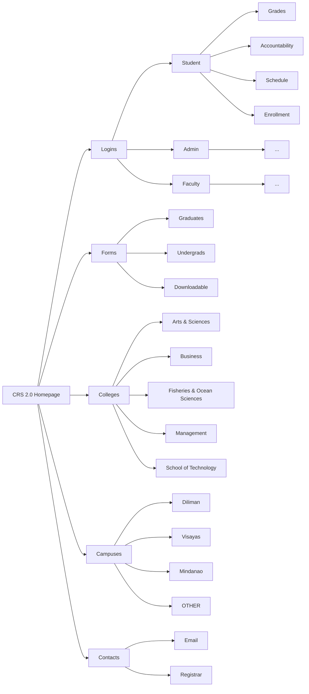

# The Long Awaited CRS 2.0 is Here!

## Overview
CRS 2.0 is a redesigned version of the University of the Philippines Visayas Course Registration System (CRS). The update aims to improve usability, performance, and reliability by introducing a more modern web-based platform that supports faster transactions and improved user experience.

### Team Members
- Justin Lauricio — Product Owner  
- Samantha Mok — Frontend Designer  
- Jhon Chriztopher Nice — Backend Developer  
- Aleighia Keith Reyes — Database Manager  

---

## Table of Contents
 
- [The Long Awaited CRS 2.0 is Here!](#the-long-awaited-crs-20-is-here)
  - [Overview](#overview)
    - [Team Members](#team-members)
  - [Table of Contents](#table-of-contents)
  - [System Summary](#system-summary)
    - [New Features](#new-features)
    - [Fixes](#fixes)
  - [🛠️ CRS 2.0 — Tech Stack](#️-crs-20--tech-stack)
    - [🎨 Frontend Tools](#-frontend-tools)
    - [⚙️ Backend Tools](#️-backend-tools)
    - [🗄️ Database](#️-database)
    - [⚡ Background Jobs \& Caching](#-background-jobs--caching)
  - [Hosting](#hosting)
  - [Mockups](#mockups)
  - [System Architecture](#system-architecture)
    - [Direct Payment Process](#direct-payment-process)
    - [CRS 2.0 Simple Sitemap](#crs-20-simple-sitemap)
    - [Course Enlistment Flowchart](#course-enlistment-flowchart)
---
## System Summary

### New Features
- Students can now see during course enlistment whether taking a course would cause a conflict with their current schedule
- Direct payment of tuition and other fees through the portal (no more separate Maya QR workaround)

### Fixes
- Improved UI and placements of navigation elements (— replaced the outdated newspaper layout)
- Unified portal experience — document requests, schedules, grades, and payments in one place instead of scattered across separate pages
- Bigger text and visual weight to improve visual hierarchy, making key information easier to scan

## 🛠️ CRS 2.0 — Tech Stack

### 🎨 Frontend Tools

The frontend is primary built with **Next.js**, a modern React-based framework that supports Server-Side Rendering (SSR) and Static Site Generation (SSG) — ensuring fast, reliable page loads even during peak enrollment periods. The stack is designed for type safety, consistent UI, and real-time data updates, making it ideal for a high-traffic university system.

| Logo | Technology | Role | Why We Chose It |
|:----:|------------|------|-----------------|
|  | **Next.js** | Core Framework | Provides SSR and SSG for fast page loads during enrollment peaks. File-based routing maps cleanly to pages. |
|  | **TypeScript** | Language | Enforces strict type checking across the codebase — prevents passing wrong data types for student records, course codes, and IDs. |
|  | **Tailwind CSS** | Styling | Utility-first CSS that ensures UI consistency across all pages — components built quickly and uniformly without custom CSS. |
|  | **React Query** | Data Fetching & Caching | Manages server state with intelligent caching and background refetching — students always see up-to-date enrollment data without full page reloads. |
|  | **Zod** | Form Validation | Validates form inputs on the frontend before they reach the backend — ensures malformed enrollment or document data is rejected early. |
|  | **Auth.js** | Authentication | Handles authentication, session management, and OAuth 2.0 integration with UP SSO providers. Supports secure role-aware access flows for students, faculty, and administrators. |

---
 
### ⚙️ Backend Tools
 
The backend is powered by **NestJS** on top of **Node.js**, providing a modular, scalable, and TypeScript-first architecture. It exposes a hybrid API layer — combining **GraphQL** for complex data queries and **REST** for action-based operations — to serve the diverse needs of students, faculty, and administrators efficiently.

| Logo | Technology | Role | Why We Chose It |
|:----:|------------|------|-----------------|
|  | **Node.js** | Runtime Environment | Non-blocking I/O handles hundreds of simultaneous enrollment requests without stalling — critical during peak enrollment windows. |
|  | **NestJS** | Backend Framework | Enforces modular architecture (e.g., `EnrollmentModule`, `GradesModule`, `AuthModule`). More structured and scalable than raw Express.js as the system grows. |
|  | **GraphQL** *(Apollo Server)* | Complex Data Queries | Lets the student dashboard fetch name, GPA, schedule, and units in a single request — reducing unnecessary API calls and over-fetching. |
|  | **REST API** *(OpenAPI/Swagger)* | Action-Based Operations | Used for file uploads, payment webhooks, grade submissions, and admission forms — clear HTTP methods for transactional operations. |
|  | **Passport.js** | API Authentication | Protects backend API endpoints. Handles JWT and session-based auth, integrates with UP SSO on the server side. |
|  | **Zod** | Backend Validation | Validates all incoming API requests and GraphQL inputs on the server side — never trusts data from the client. |

---
 
### 🗄️ Database
 
CRS 2.0 uses **PostgreSQL** as its primary relational database — chosen for its ACID compliance, relational integrity, and powerful features like triggers and full-text search. **Prisma ORM** sits on top to provide type-safe queries and clean schema migrations. **PgBouncer** is added to handle connection pooling under high concurrency.

| Logo | Technology | Role | Why We Chose It |
|:----:|------------|------|-----------------|
|  | **PostgreSQL** | Primary Database | ACID-compliant transactions prevent double enrollments and lost records. Supports complex relationships: students, courses, prerequisites, schedules, and grades. |
|  | **Prisma ORM** | Database Access Layer | Auto-generates TypeScript types from the DB schema for type-safe queries. Handles migrations with rollback support and includes a visual DB explorer (Prisma Studio). |
|  | **PgBouncer** | Connection Pooler | Acts as a proxy between NestJS and PostgreSQL — prevents connection exhaustion when hundreds of students submit requests simultaneously. |

---
 
### ⚡ Background Jobs & Caching

Enrollment requests are processed asynchronously using **Bull** queues backed by **Redis** — so no request is lost even under heavy load. Two separate Redis instances are used: one for volatile caching and one for persistent job queuing.

| Logo | Technology | Role | Why We Chose It |
|:----:|------------|------|-----------------|
|  | **Redis** *(Cache Instance)* | Data Caching | Caches course catalog, schedule data, GPA, and sessions — reduces repetitive DB queries. Short TTLs ensure data freshness. |
|  | **Redis** *(Queue Instance)* | Job Queue Broker | Separate persistent Redis instance for the job queue. Configured with RDB snapshots and AOF so pending jobs survive crashes. |
|  | **BullMQ** | Job Queue Library | Handles asynchronous tasks such as enrollment processing, grade calculations, email notifications, and TOR generation. Provides retry mechanisms, concurrency control, and dead-letter queue support for failed jobs. |

---

## Hosting
<!-- Hostings -->

## Mockups
<!-- Screenshots -->

## System Architecture 

The following diagrams illustrates the workflows and structure of CRS 2.0

### Direct Payment Process

---

### CRS 2.0 Simple Sitemap

---

### Course Enlistment Flowchart

