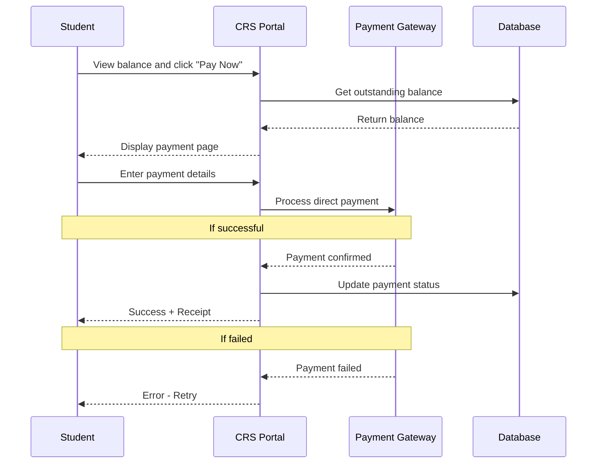
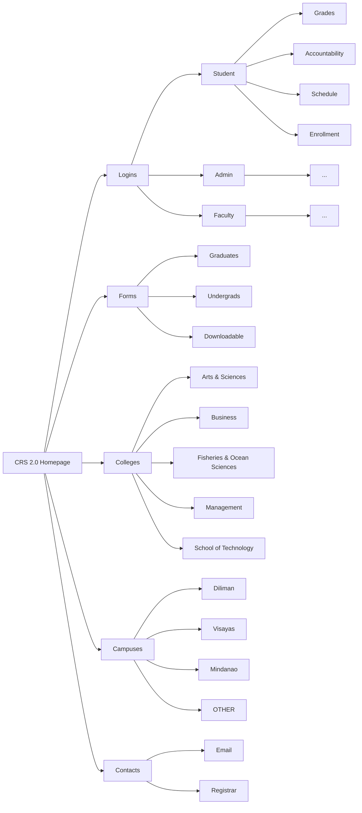
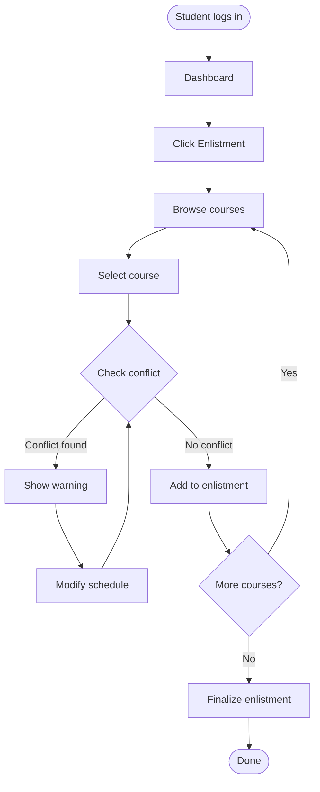

# The Long Awaited CRS 2.0 is Here!

## Overview
CRS 2.0 is a redesigned version of the University of the Philippines Visayas Course Registration System (CRS). The update aims to improve usability, performance, and reliability by introducing a more modern web-based platform that supports faster transactions and improved user experience.

### Team Members
- Justin Lauricio — Product Owner  
- Samantha Mok — Frontend Designer  
- Jhon Chriztopher Nice — Backend Developer  
- Aleighia Keith Reyes — Database Manager  

---

## Table of Contents
 
- [System Summary](#system-summary)
- [Tech Stack](#tech-stack)
    - [Frontend Tools](#frontend-tools)
    - [Backend Tools](#backend-tools)
    - [Database](#database)
    - [Other Tools](#other-tools)
- [Hosting](#hosting)
- [Mockups](#mockups)
- [System Architecture](#system-architecture)
---
## System Summary

### New Features
- Students can now see during course enlistment whether taking a course would cause a conflict with their current schedule
- Direct payment of tuition and other fees through the portal (no more separate Maya QR workaround)

### Fixes
- Improved UI and placements of navigation elements (— replaced the outdated newspaper layout)
- Unified portal experience — document requests, schedules, grades, and payments in one place instead of scattered across separate pages
- Bigger text and visual weight to improve visual hierarchy, making key information easier to scan

## Tech Stack
 
### Frontend Tools
 
<!-- Front end Tools here -->
 
### Backend Tools
 
<!-- Backend tools here -->
 
### Database
 
<!-- Database here -->
 
### Other Tools
 
<!-- Other tool if any -->

## Hosting
<!-- Hostings -->

## Mockups
<!-- Screenshots -->

## System Architecture 

The following diagrams illustrates the workflows and structure of CRS 2.0

### Direct Payment Process

---

### CRS 2.0 Simple Sitemap

---

### Course Enlistment Flowchart

