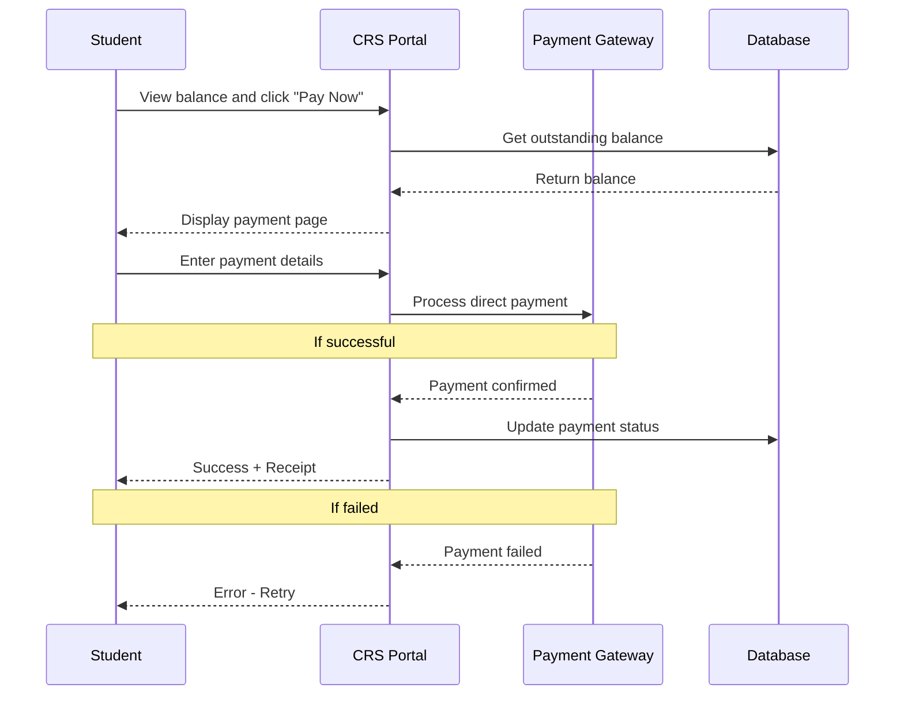
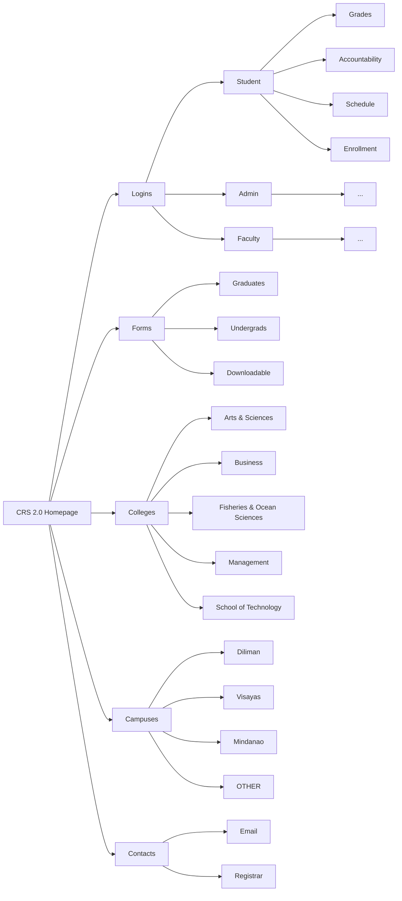

# The Long Awaited CRS 2.0 is Here!

## Overview
CRS 2.0 is a redesigned version of the University of the Philippines Visayas Course Registration System (CRS). The update aims to improve usability, performance, and reliability by introducing a more modern web-based platform that supports faster transactions and improved user experience.

### Team Members
- Justin Lauricio — Product Owner  
- Samantha Mok — Frontend Designer  
- Jhon Chriztopher Nice — Backend Developer  
- Aleighia Keith Reyes — Database Manager  

---

## Table of Contents
 
- [The Long Awaited CRS 2.0 is Here!](#the-long-awaited-crs-20-is-here)
  - [Overview](#overview)
    - [Team Members](#team-members)
  - [Table of Contents](#table-of-contents)
  - [System Summary](#system-summary)
    - [New Features](#new-features)
    - [Fixes](#fixes)
  - [🛠️ CRS 2.0 — Tech Stack](#️-crs-20--tech-stack)
    - [🎨 Frontend Tools](#-frontend-tools)
    - [Backend Tools](#backend-tools)
    - [Database](#database)
    - [Other Tools](#other-tools)
  - [Hosting](#hosting)
  - [Mockups](#mockups)
  - [System Architecture](#system-architecture)
    - [Direct Payment Process](#direct-payment-process)
    - [CRS 2.0 Simple Sitemap](#crs-20-simple-sitemap)
    - [Course Enlistment Flowchart](#course-enlistment-flowchart)
---
## System Summary

### New Features
- Students can now see during course enlistment whether taking a course would cause a conflict with their current schedule
- Direct payment of tuition and other fees through the portal (no more separate Maya QR workaround)

### Fixes
- Improved UI and placements of navigation elements (— replaced the outdated newspaper layout)
- Unified portal experience — document requests, schedules, grades, and payments in one place instead of scattered across separate pages
- Bigger text and visual weight to improve visual hierarchy, making key information easier to scan

## 🛠️ CRS 2.0 — Tech Stack

### 🎨 Frontend Tools

The frontend is primary built with **Next.js**, a modern React-based framework that supports Server-Side Rendering (SSR) and Static Site Generation (SSG) — ensuring fast, reliable page loads even during peak enrollment periods. The stack is designed for type safety, consistent UI, and real-time data updates, making it ideal for a high-traffic university system.

| Logo | Technology | Role | Why We Chose It |
|:----:|------------|------|-----------------|
|  | **Next.js** | Core Framework | Provides SSR and SSG for fast page loads during enrollment peaks. File-based routing maps cleanly to pages. |
|  | **TypeScript** | Language | Enforces strict type checking across the codebase — prevents passing wrong data types for student records, course codes, and IDs. |
|  | **Tailwind CSS** | Styling | Utility-first CSS that ensures UI consistency across all pages — components built quickly and uniformly without custom CSS. |
|  | **React Query** | Data Fetching & Caching | Manages server state with intelligent caching and background refetching — students always see up-to-date enrollment data without full page reloads. |
|  | **Zod** | Form Validation | Validates form inputs on the frontend before they reach the backend — ensures malformed enrollment or document data is rejected early. |
|  | **Auth.js** | Authentication | Handles authentication, session management, and OAuth 2.0 integration with UP SSO providers. Supports secure role-aware access flows for students, faculty, and administrators. |
 
### Backend Tools
 
<!-- Backend tools here -->
 
### Database
 
<!-- Database here -->
 
### Other Tools
 
<!-- Other tool if any -->

## Hosting
<!-- Hostings -->

## Mockups
<!-- Screenshots -->

## System Architecture 

The following diagrams illustrates the workflows and structure of CRS 2.0

### Direct Payment Process

---

### CRS 2.0 Simple Sitemap

---

### Course Enlistment Flowchart

